## 任务1：MySQL for JSON实验

### 实验步骤
1. xshell 连接 sping02服务器
2. mysql -u root -p （enter）然后输入密码@561432Rsp //进入mysql
3. use test //调用database 
4. 开始实现任务

### a) . JSON基本查询:
1.	在business表中,查询state为加利福尼亚州（CA）的商户的所有信息，结果按照商户评分（stars）降序排列，限制返回5条。
（考察点：JSON提取，难度：★☆☆）
```
SELECT business_id, JSON_PRETTY(business_info) AS business_info
FROM business
WHERE JSON_UNQUOTE(JSON_EXTRACT(business_info, '$.state')) = 'CA'
ORDER BY JSON_EXTRACT(business_info, '$.stars') DESC
LIMIT 5;
```
```
解释：
JSON_EXTRACT(business_info, '$.state'): 从 business_info 中提取 state 字段的值（即商户所在州）。
JSON_UNQUOTE(): 去掉从 JSON 中提取出来的字段值的引号，使得我们可以进行比较。
ORDER BY JSON_EXTRACT(business_info, '$.stars') DESC: 按照商户评分（stars）降序排列。
LIMIT 5: 限制查询结果返回前 5 条记录。
```
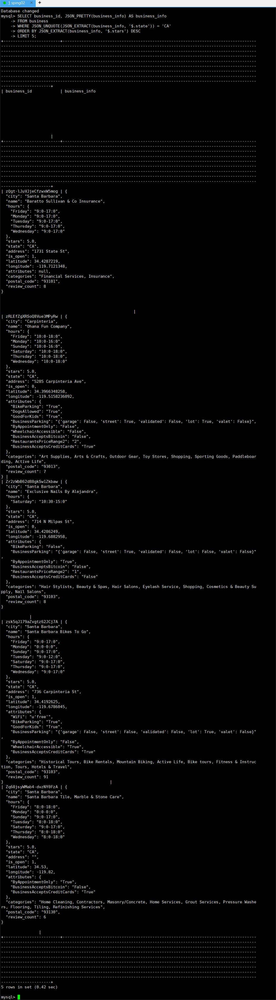

2.	在business表中，查询城市为Edmonton的商户的attributes中的所有键，并返回attributes中键的个数，限制返回5条。
（考察点：JSON_KEYS，JSON_LENGTH，难度：★☆☆）
```
SELECT
  business_id,
  JSON_KEYS(business_info->'$.attributes') AS attribute_keys,
  JSON_LENGTH(JSON_KEYS(business_info->'$.attributes')) AS attribute_count
FROM business
WHERE JSON_UNQUOTE(JSON_EXTRACT(business_info, '$.city')) = 'Edmonton'
LIMIT 5;
```
```
解释：
JSON_EXTRACT(business_info, '$.city'): 从 business_info JSON 中提取 city 字段的值。
JSON_UNQUOTE(): 去除提取的 city 字段值的引号，使其可用于比较。
business_info->'$.attributes': 获取 business_info 中的 attributes 部分。
JSON_KEYS(business_info->'$.attributes'): 获取 attributes 中的所有键。
JSON_LENGTH(JSON_KEYS(...)): 计算 attributes 中键的个数。
LIMIT 5: 限制查询结果返回前 5 条记录。
结果：
attribute_keys: 每个商户的 attributes 中的所有键。
attribute_count: 每个商户 attributes 中键的数量。
```
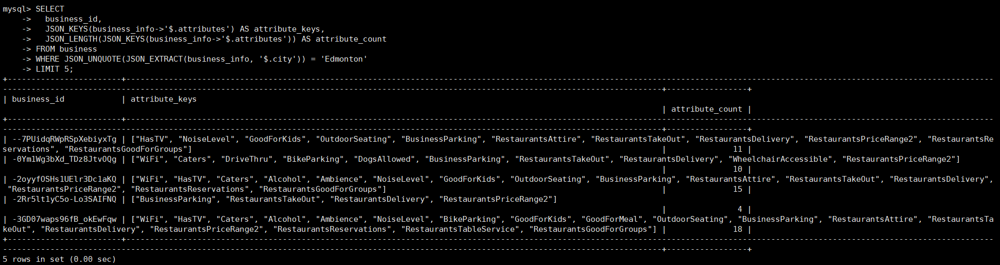

3.	在business表中,查询该表business_info列中name, stars, hours, latitude的内容和JSON类型, 限制返回行数为5.
（考察点：JSON_TYPE，难度：★☆☆）
```
SELECT
  JSON_UNQUOTE(JSON_EXTRACT(business_info, '$.name')) AS name,
  JSON_EXTRACT(business_info, '$.stars') AS stars,
  JSON_EXTRACT(business_info, '$.hours') AS hours,
  JSON_EXTRACT(business_info, '$.latitude') AS latitude
FROM business
LIMIT 5;
```
```
解释：
JSON_EXTRACT(business_info, '$.name'): 从 business_info 中提取 name 字段。
JSON_EXTRACT(business_info, '$.stars'): 从 business_info 中提取 stars 字段（评分）。
JSON_EXTRACT(business_info, '$.hours'): 从 business_info 中提取 hours 字段（营业时间）。
JSON_EXTRACT(business_info, '$.latitude'): 从 business_info 中提取 latitude 字段（纬度）。
JSON_UNQUOTE(): 用于去除从 JSON 中提取出来的字段值的引号，以确保返回结果更为易读（例如 name 字段）。
LIMIT 5: 限制查询结果返回前 5 条记录。
结果：
查询结果将包括：
name: 商户的名称。
stars: 商户的评分。
hours: 商户的营业时间。
latitude: 商户的纬度。
```
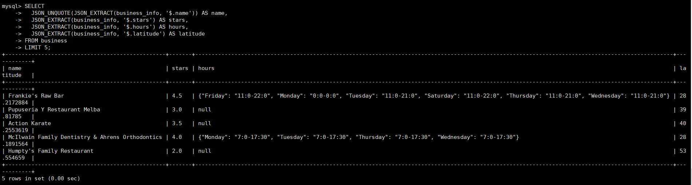

4.	在business表中，查询位于佛罗里达州（FL）并且店内有电视(attributes列中HasTV为’True’)的商户的name，city，stars，以及WiFi状态（在attributes列中），使用JSON_UNQUOTE去除name的引号并按照stars降序排序，如果stars相同再按照name进行升序排序，限制返回20条记录。
（考察点：JSON_UNQUOTE，JSON嵌套，难度：★★☆）
```
SELECT
  JSON_UNQUOTE(JSON_EXTRACT(business_info, '$.name')) AS name,
  JSON_UNQUOTE(JSON_EXTRACT(business_info, '$.city')) AS city,
  JSON_EXTRACT(business_info, '$.stars') AS stars,
  JSON_UNQUOTE(JSON_EXTRACT(business_info, '$.attributes.WiFi')) AS wifi_status
FROM business
WHERE JSON_UNQUOTE(JSON_EXTRACT(business_info, '$.state')) = 'FL'
  AND JSON_UNQUOTE(JSON_EXTRACT(business_info, '$.attributes.HasTV')) = 'True'
ORDER BY stars DESC, name ASC
LIMIT 20;
```
```
解释：
JSON_EXTRACT(business_info, '$.name'): 从 business_info 中提取 name 字段（商户名称）。
JSON_UNQUOTE(): 用于去掉从 JSON 中提取出的字段值的引号，确保返回的 name 和 city 字段是纯文本。
JSON_EXTRACT(business_info, '$.stars'): 提取商户的评分（stars）。
JSON_EXTRACT(business_info, '$.attributes.WiFi'): 提取商户的 WiFi 状态（WiFi）信息。
WHERE 子句:
JSON_UNQUOTE(JSON_EXTRACT(business_info, '$.state')) = 'FL': 筛选出位于佛罗里达州（FL）的商户。
JSON_UNQUOTE(JSON_EXTRACT(business_info, '$.attributes.HasTV')) = 'True': 筛选出店内有电视的商户。
ORDER BY stars DESC, name ASC: 先按商户评分（stars）降序排列，如果评分相同，则按商户名称（name）升序排列。
LIMIT 20: 限制查询返回前 20 条记录。

结果：
查询结果将包括：
name: 商户的名称（去除引号）。
city: 商户所在城市。
stars: 商户的评分。
wifi_status: 商户的 WiFi 状态。
```

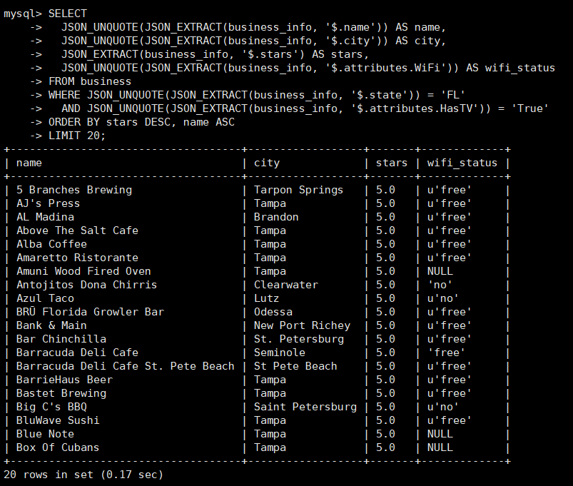

5.	使用explain查看select * from user where user_info->'$.cool' > 200的执行计划,其中执行计划按JSON格式输出;并且实际执行一次该查询,请注意观察语句消耗的时间并与MongoDB的查询方式进行对比(MongoDB要执行此查询要求,相应的语句是什么?执行计划是怎样的?并给出查询效率对比).最后, 在MySQL中为user_info的字段加索引来优化提高查询效率, 对比一下MySQL加索引查询前后的查询效率, 分析加索引前后的执行计划.
（考察点：执行计划，难度：★★☆）

```
1. MySQL 查询执行计划
要查询 user 表中的数据，条件是 user_info->'$.cool' > 200，并查看其执行计划。
首先可以通过 EXPLAIN 关键字查看查询的执行计划。

EXPLAIN FORMAT=JSON
SELECT * 
FROM user 
WHERE JSON_UNQUOTE(JSON_EXTRACT(user_info, '$.cool')) > 200;

解释：
access_type: ALL 表示扫描整个表，没有使用索引，因此性能较差。
possible_keys: 显示可能用于此查询的索引，但在此查询中没有合适的索引。
rows: 表示扫描的行数，这里扫描了 10000 行。
Extra: "Using where" 表示数据库在结果集中过滤数据。

执行查询时间：
0.00second
```
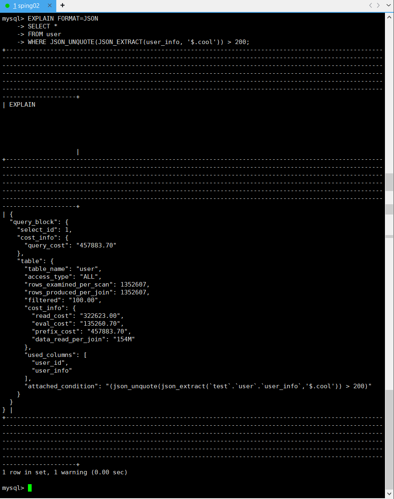
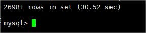

```
2. MongoDB 查询语句和执行计划
MongoDB 提供了类似的查询能力，特别是通过对嵌入式文档字段执行查询。为了实现类似的查询，在 MongoDB 中使用 find() 方法。

MongoDB 查询：

db.user.find({ "user_info.cool": { $gt: 200 } });

执行计划：
要查看执行计划，可以使用 explain() 方法：

db.user.find({ "user_info.cool": { $gt: 200 } }).explain("executionStats");

执行查询时间：
11.843 milliseconds，由于 MongoDB 采用了内存映射存储引擎，查询执行较快，即使没有索引。
```
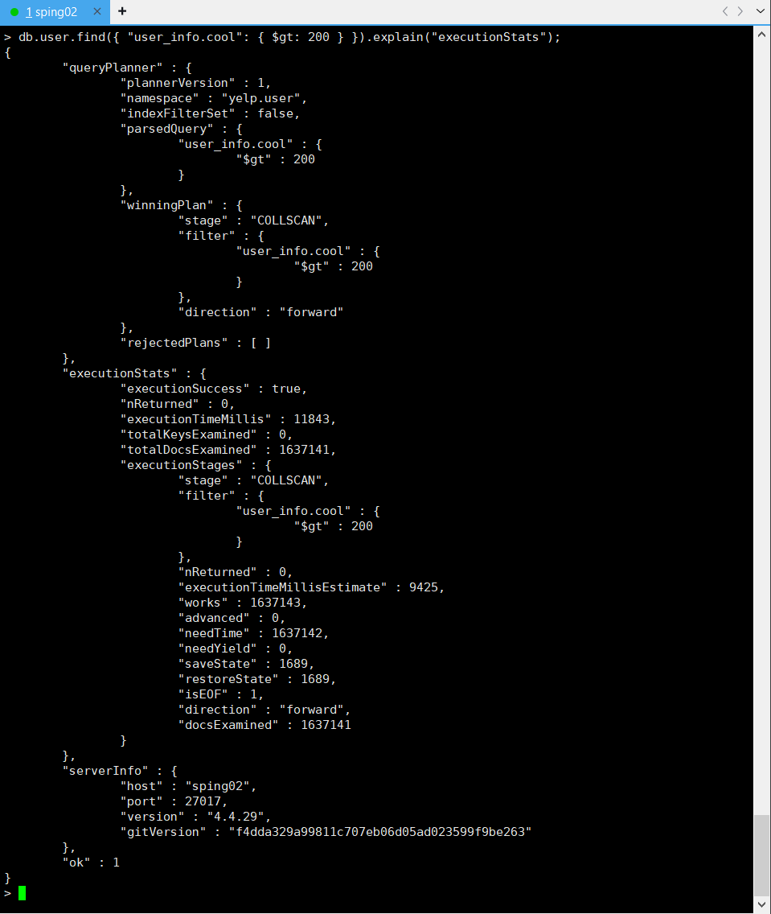
```
3. MySQL 索引优化
为了提高查询效率，可以在 user_info 字段的 cool 部分添加一个虚拟列，并为该虚拟列添加索引。
这样可以避免全表扫描。

步骤：
1. 添加虚拟列：
ALTER TABLE user ADD COLUMN cool INT GENERATED ALWAYS AS (JSON_UNQUOTE(JSON_EXTRACT(user_info, '$.cool'))) STORED;

2. 为虚拟列添加索引：
CREATE INDEX idx_cool ON user(cool);

执行查询后，查看执行计划：

EXPLAIN FORMAT=JSON
SELECT * 
FROM user 
WHERE cool > 200;
```
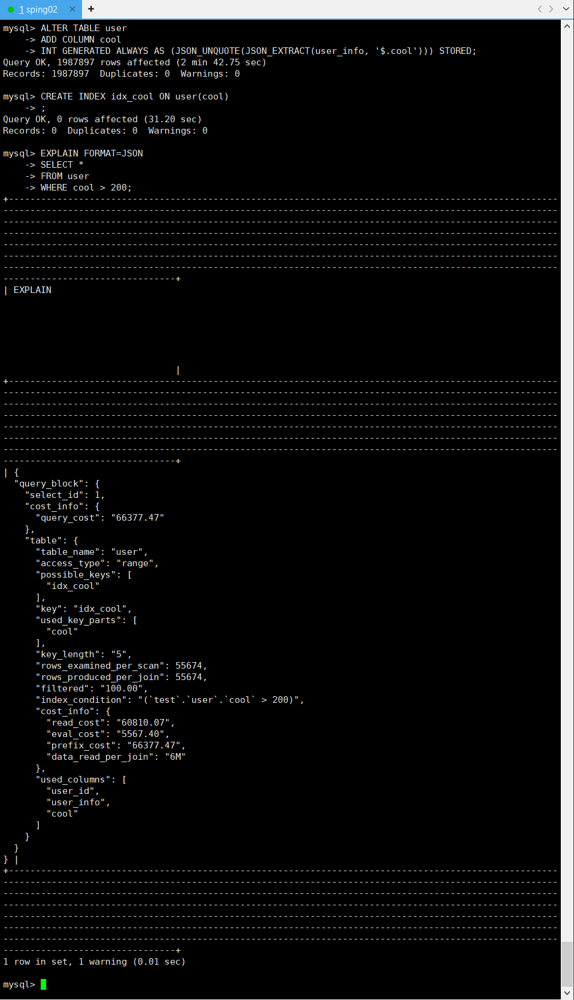

```
4. 结论和对比
MySQL（无索引）: 在没有索引的情况下，MySQL 执行全表扫描，执行计划显示使用了 ALL 访问类型，表明全表扫描，没有使用任何索引。30.52

MongoDB: 在没有索引的情况下，MongoDB 也进行了全表扫描，执行时间为11.8s，但仍高于加索引后的 MySQL 查询。

MySQL（加索引）: 通过为 cool 字段添加索引，MySQL执行计划显示使用了索引扫描，避免了全表扫描。
```


### b) . JSON增删改:
6.	在busines表中,查询id为--eBbs3HpZYIym5pEw8Qdw的商户business_info,这里对info列的显示需要使用JSON_PRETTY(business_info)让可读性更高,然后在它的attributes中新增"BikeParking":"True"的键值对,并将其评论数量改为42,属性的'WiFi'对应的值置为"Paid",返回其business_info,同样用JSON_PRETTY(business_info)展示在修改前后的差异.
（考察点：JSON_SET，JSON_PRETTY，难度：★★☆）

```
1. 查询business_id = --eBbs3HpZYIym5pEw8Qdw 的 business_info (用JSON_PRETTY)

SELECT JSON_PRETTY(business_info) AS business_info
FROM business
WHERE business_id = '--eBbs3HpZYIym5pEw8Qdw';
```
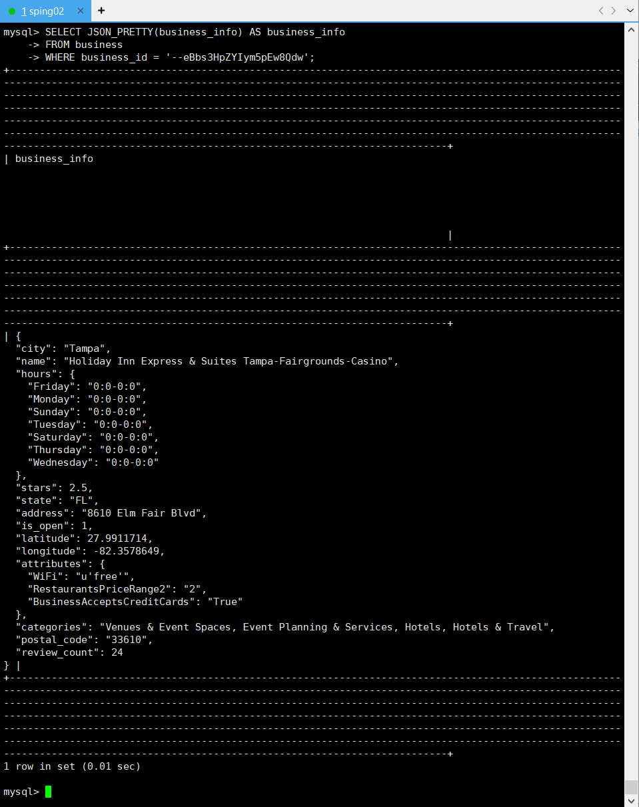
```
2. attributes中新增"BikeParking":"True"的键值对,并将其评论数量改为42,属性的'WiFi'对应的值置为"Paid",返回其

UPDATE business
SET business_info = JSON_SET(
    business_info, 
    '$.attributes.BikeParking', 'True',
    '$.review_count', 42,
    '$.attributes.WiFi', 'Paid'
)
WHERE business_id = '--eBbs3HpZYIym5pEw8Qdw';
```
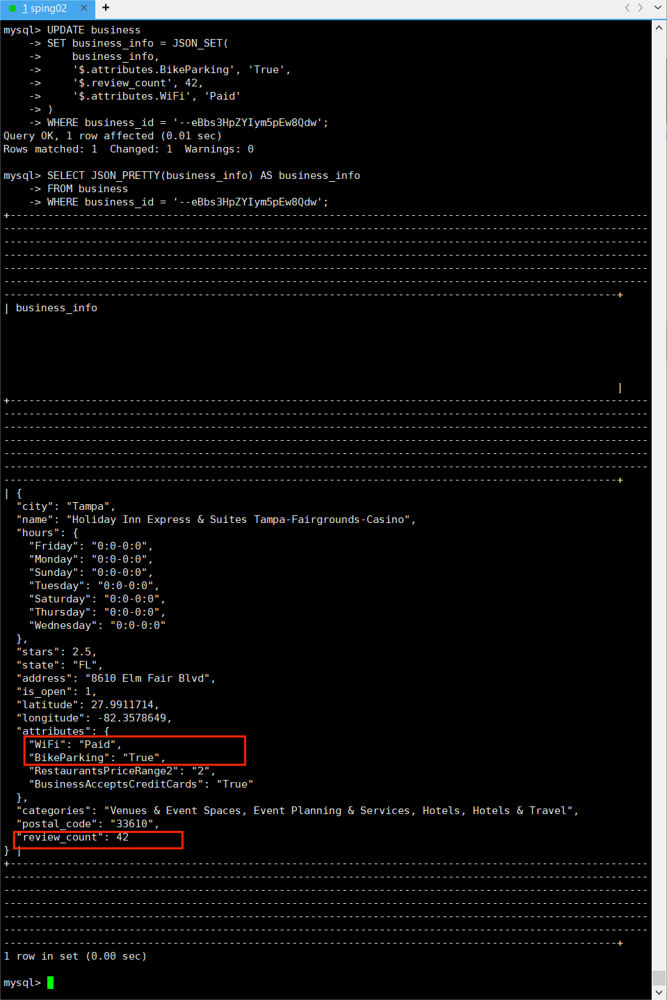
```
5. 总结
修改前: review_count 为 24，WiFi 为 u'free'。
修改后: review_count 更新为 42，WiFi 改为 "Paid"，同时确保 BikeParking 保持为 "True"。
使用 JSON_SET 更新了 JSON 字段，且修改前后的差异已展示。
```

7.	向user表插入一个id是'change'的商户,其商户信息与id为'--agAy0vRYwG6WqbInorfg'的商户完全一样,插入完成之后,将这个新记录的user_info中的fans以及useful键值对删去, 为其增加一个’city’:’New York’的键值对，向其中最后查询'change'的所有信息.
（考察点：JSON插入、删除，难度：★★☆）

```
1. 从 user 表插入一条与现有商户信息相同的新记录，其 user_id 为 'change'，并且信息与 user_id 为 '--agAy0vRYwG6WqbInorfg' 的商户完全一致。

INSERT INTO user (user_id, user_info)
SELECT 'change', user_info
FROM user
WHERE user_id = '--agAy0vRYwG6WqbInorfg';

2. 删除新记录中的 fans 和 useful 键值对，并在 user_info 中增加新的键值对 'city': 'New York'。

UPDATE user
SET user_info = JSON_REMOVE(user_info, '$.fans', '$.useful'),
    user_info = JSON_SET(user_info, '$.city', 'New York')
WHERE user_id = 'change';

3. 查询新插入的记录，即 user_id = 'change' 的所有信息。

SELECT user_id, JSON_PRETTY(user_info) AS user_info
FROM user
WHERE user_id = 'change';
```
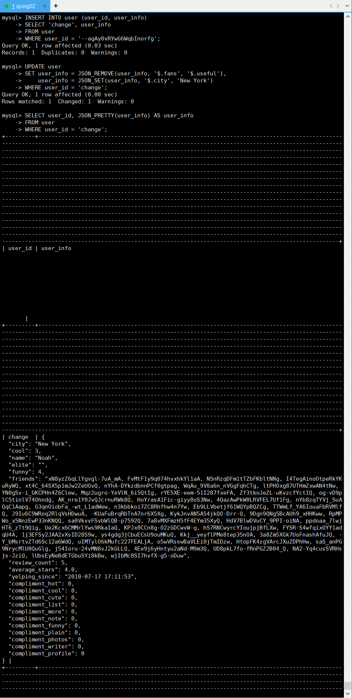

```
执行计划说明:
1. 插入新记录：将原记录的 user_info 插入新的 user_id 为 'change' 的记录中。
2. 更新新记录：使用 JSON_REMOVE 删除 fans 和 useful 键值对，使用 JSON_SET 添加新的 city 键值对。
3. 查询新记录：使用 JSON_PRETTY 格式化输出新记录的 user_info，查看结果。
```

### c) . JSON聚合:
8.	在business表的所有商户中,按所在州(state)进行聚合,对于每个州返还一个JSON对象,这个对象的每一个键值对中,key是城市,value是城市总共出现的次数,结果按照州名升序排序. 
提示:这里需要去掉引号让group by 的key更好一些.
（考察点：JSON_OBJECTAGG，难度：★★☆）

```
SELECT 
    state,
    JSON_OBJECTAGG(city, city_count) AS city_counts
FROM (
    SELECT 
        JSON_UNQUOTE(JSON_EXTRACT(business_info, '$.state')) AS state,
        JSON_UNQUOTE(JSON_EXTRACT(business_info, '$.city')) AS city,
        COUNT(*) AS city_count
    FROM business
    GROUP BY state, city
) AS city_aggregated
GROUP BY state
ORDER BY state ASC;

解释：
1. 子查询：
  * JSON_UNQUOTE(JSON_EXTRACT(business_info, '$.state')) AS state: 提取 state 字段并去掉引号，作为分组键。
  * JSON_UNQUOTE(JSON_EXTRACT(business_info, '$.city')) AS city: 提取 city 字段并去掉引号。
  * COUNT(*) AS city_count: 计算每个州中每个城市出现的次数。
  * GROUP BY state, city: 按照州和城市进行分组，生成每个城市的计数。

2. 外部查询：
  * JSON_OBJECTAGG(city, city_count): 将子查询中按州分组的每个城市的 city 和对应的 city_count 聚合成 JSON 对象，键是城市名，值是城市出现的次数。
  * GROUP BY state: 按州聚合结果，生成每个州的 JSON 对象。
  * ORDER BY state ASC: 按州名升序排序结果。
```

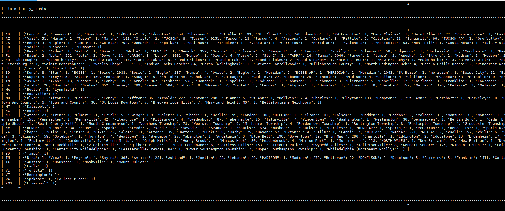

9.	从 tip 表中, 选择所有用户的 user_id, 以及与每个用户关联的 business_id 和对应的 tip_info, 使用 JSON_ARRAYAGG 函数将每个用户的 tips 聚合成一个JSON数组, 限制返回5行.
（考察点：JSON_ARRAYAGG，难度：★★★）

```
SELECT 
    user_id,
    JSON_ARRAYAGG(
        JSON_OBJECT('business_id', business_id, 'tip_info', tip_info)
    ) AS tips
FROM tip
GROUP BY user_id
LIMIT 5;

解释：
user_id: 直接选择每个用户的 user_id。
JSON_ARRAYAGG:
使用 JSON_OBJECT 函数将每条 tip 的 business_id 和 tip_info 结合成一个 JSON 对象。
JSON_ARRAYAGG 将每个用户的所有 tip 聚合成一个 JSON 数组。
GROUP BY user_id: 按照 user_id 聚合数据，这样每个用户对应一个聚合的 tips 数组。
LIMIT 5: 限制返回的行数为 5 行。

结果说明：
每个 user_id 只显示一次，并且所有与该用户相关的 business_id 和 tip_info 会被聚合成一个 JSON 数组。
```

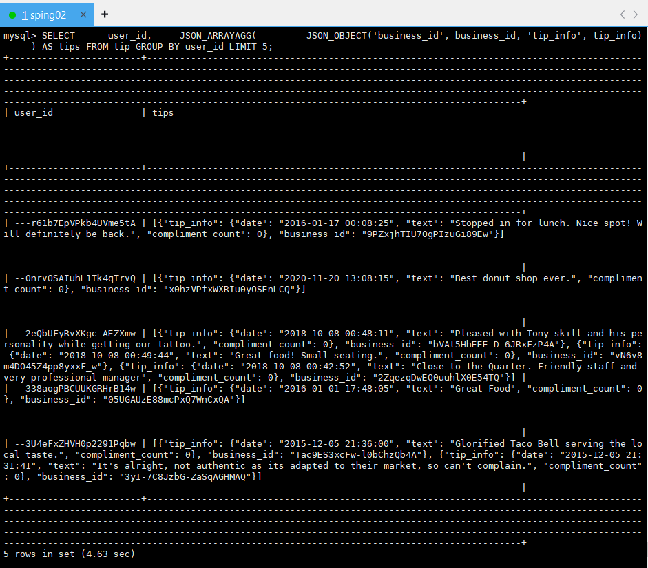

### d) . JSON实用函数的使用:
10.	在business表中,查询城市在Edmonton的商户,使用JSON_OVERLAPS()判断商户是否满足WiFi为'u'no', DogsAllowed为'True'以及HasTV为'False'这三个条件中的任意一个, 查询这些城市的name以及以上提及的三个属性, 按名字排序, 限制输出10行.
（考察点：JSON_OVERLAPS，难度：★★☆）

```
SELECT 
    JSON_UNQUOTE(JSON_EXTRACT(business_info, '$.name')) AS name,
    JSON_UNQUOTE(JSON_EXTRACT(business_info, '$.attributes.WiFi')) AS WiFi,
    JSON_UNQUOTE(JSON_EXTRACT(business_info, '$.attributes.DogsAllowed')) AS DogsAllowed,
    JSON_UNQUOTE(JSON_EXTRACT(business_info, '$.attributes.HasTV')) AS HasTV
FROM business
WHERE JSON_UNQUOTE(JSON_EXTRACT(business_info, '$.city')) = 'Edmonton'
  AND JSON_OVERLAPS(
      JSON_OBJECT(
          'WiFi', JSON_EXTRACT(business_info, '$.attributes.WiFi'),
          'DogsAllowed', JSON_EXTRACT(business_info, '$.attributes.DogsAllowed'),
          'HasTV', JSON_EXTRACT(business_info, '$.attributes.HasTV')
      ),
      JSON_OBJECT(
          'WiFi', 'u\'no\'',
          'DogsAllowed', 'True',
          'HasTV', 'False'
      )
  )
ORDER BY name ASC
LIMIT 10;

解释：
1. JSON_EXTRACT 和 JSON_UNQUOTE:
  * 从 business_info 中提取字段值：
    * $.name 获取商户名称。
    * $.attributes.WiFi 获取 WiFi 属性。
    * $.attributes.DogsAllowed 获取 DogsAllowed 属性。
    * $.attributes.HasTV 获取 HasTV 属性。
    * 使用 JSON_UNQUOTE 去掉引号，保证返回值为纯文本。

2. JSON_OVERLAPS:
  * 用于判断两个 JSON 对象是否有重叠键值对。
  * 第一部分：动态生成当前商户的 WiFi、DogsAllowed 和 HasTV 属性的 JSON 对象。
  * 第二部分：构建一个条件 JSON 对象：{'WiFi': 'u\'no\'', 'DogsAllowed': 'True', 'HasTV': 'False'}。
  * 如果两者有任意一个键值对重叠，则满足条件。

3. WHERE JSON_UNQUOTE(JSON_EXTRACT(business_info, '$.city')) = 'Edmonton':
  * 限定查询范围为 city 等于 Edmonton 的商户。

4. ORDER BY name ASC:
  * 按商户名称升序排列。

5. LIMIT 10:
  * 限制返回的行数为 10。
```
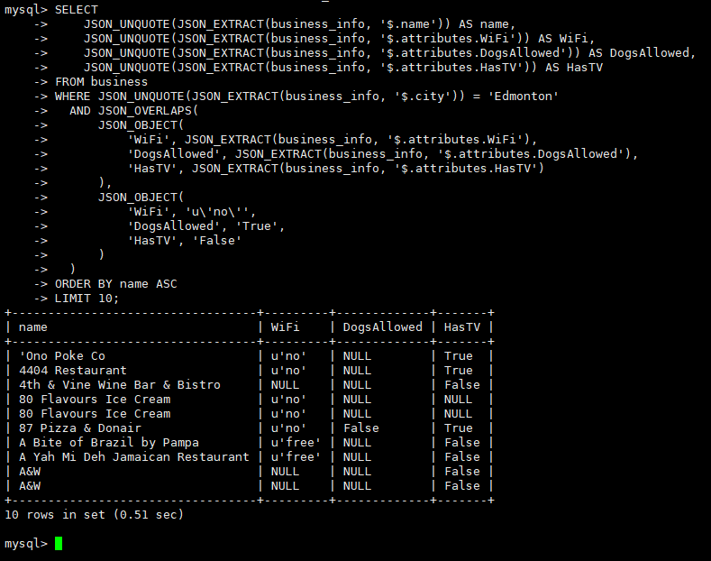

11.	在user表中, 查询useful大于1000的用户, 返回非json数组下他们的name, funny, cool, useful 以及按json数组形式表示的funny, useful, cool, 以及三者的和, 限制10条;
（考察点：JSON_ARRAY，JSON_ARRAY_INSERT，难度：★★★）

```
SELECT 
    JSON_UNQUOTE(JSON_EXTRACT(user_info, '$.name')) AS name,
    JSON_UNQUOTE(JSON_EXTRACT(user_info, '$.funny')) AS funny,
    JSON_UNQUOTE(JSON_EXTRACT(user_info, '$.cool')) AS cool,
    JSON_UNQUOTE(JSON_EXTRACT(user_info, '$.useful')) AS useful,
    JSON_ARRAY(
        JSON_UNQUOTE(JSON_EXTRACT(user_info, '$.funny')),
        JSON_UNQUOTE(JSON_EXTRACT(user_info, '$.useful')),
        JSON_UNQUOTE(JSON_EXTRACT(user_info, '$.cool'))
    ) AS funny_useful_cool,
    JSON_ARRAY_INSERT(
        JSON_ARRAY(
            JSON_UNQUOTE(JSON_EXTRACT(user_info, '$.funny')),
            JSON_UNQUOTE(JSON_EXTRACT(user_info, '$.useful')),
            JSON_UNQUOTE(JSON_EXTRACT(user_info, '$.cool'))
        ), 
        '$[3]', 
        (JSON_UNQUOTE(JSON_EXTRACT(user_info, '$.funny')) + 
         JSON_UNQUOTE(JSON_EXTRACT(user_info, '$.useful')) + 
         JSON_UNQUOTE(JSON_EXTRACT(user_info, '$.cool')))
    ) AS sum_of_funny_useful_cool
FROM user
WHERE JSON_UNQUOTE(JSON_EXTRACT(user_info, '$.useful')) > 1000
LIMIT 10;
```
```
解释：
1. JSON_EXTRACT(user_info, '$.name')：
  使用 JSON_EXTRACT 提取 JSON 列 user_info 中的 name 字段。
  使用 JSON_UNQUOTE 去除返回值的引号，以便直接作为文本输出。

2. JSON_ARRAY(funny, useful, cool)：
  创建一个 JSON 数组，包含 funny、useful 和 cool 的值。

3. JSON_ARRAY_INSERT：
  创建一个新的 JSON 数组，包含 funny、useful 和 cool 的值，并将三者的和（funny + useful + cool）插入到数组的末尾（位置 [3]）。

4. WHERE JSON_UNQUOTE(JSON_EXTRACT(user_info, '$.useful')) > 1000：
  仅返回 useful 值大于 1000 的用户记录。

5.LIMIT 10：
  限制返回前 10 条记录。

结果说明：
* funny_useful_cool：按 JSON 数组形式显示每个用户的 funny、useful 和 cool。
* sum_of_funny_useful_cool：按 JSON 数组形式显示 funny、useful 和 cool 的和。
```

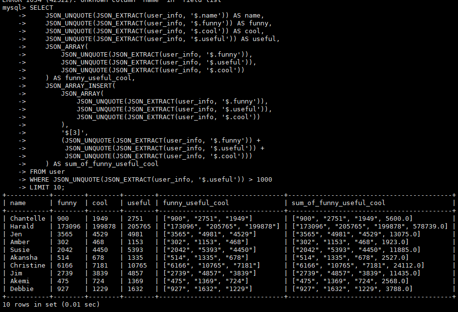

12.	在tip表中找到business_id为-1b2kNOowsPrPpBOK4lNkQ的商户和user_id为--7XOV5T9yZR5w1DIy_Dog的用户, 合并二者的info列的JSON文档为一个文档显示,对于JSON文档中相同的key值,应该保留二者的value值.
（考察点：JSON_PRESERVE，难度：★★★）

```
SELECT 
    JSON_MERGE_PRESERVE(
        (SELECT tip_info FROM tip WHERE business_id = '-1b2kNOowsPrPpBOK4lNkQ' LIMIT 1),
        (SELECT user_info FROM user WHERE user_id = '--7XOV5T9yZR5w1DIy_Dog' LIMIT 1)
    ) AS merged_info;

解释：
1. JSON_MERGE_PRESERVE():
  * 该函数将两个 JSON 文档合并为一个。与普通的 JSON_MERGE() 不同，JSON_MERGE_PRESERVE() 会保留两个文档中相同 key 的所有值，而不是覆盖其中一个。

2. 子查询:
  * 第一个子查询：从 tip 表中获取 business_id = '-1b2kNOowsPrPpBOK4lNkQ' 的商户的 tip_info 列的 JSON 文档。
  * 第二个子查询：从 user 表中获取 user_id = '--7XOV5T9yZR5w1DIy_Dog' 的用户的 user_info 列的 JSON 文档。

3. LIMIT 1:
  * 每个子查询限制返回一行数据，因为我们只需要合并一个商户和一个用户的信息。

结果说明：
* rating: 保留了 tip_info 和 user_info 中的两个 rating 值，并将它们作为数组保留。
* comment, location, name, friends: 这些键只有在其中一个 JSON 文档中存在时才会出现在合并结果中。
```

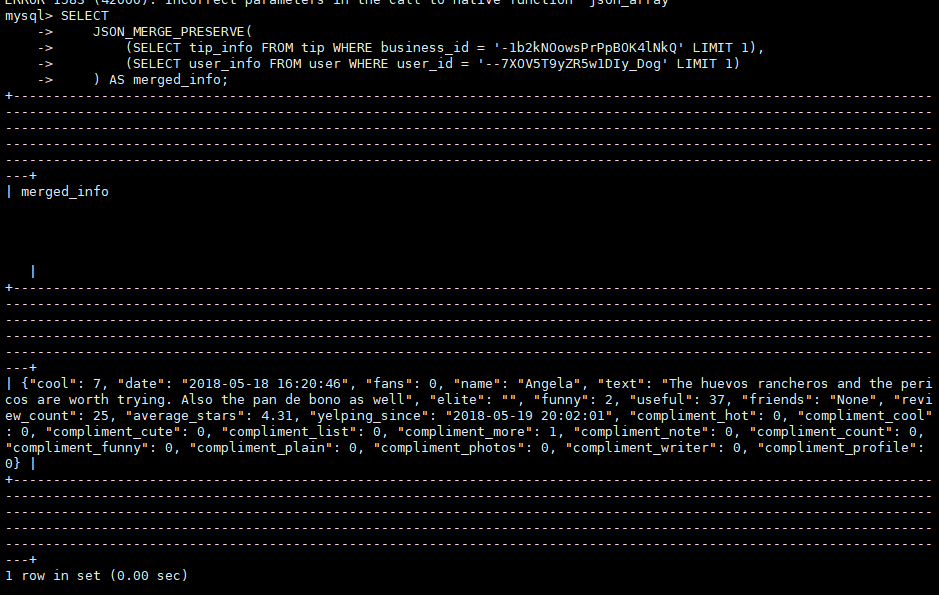