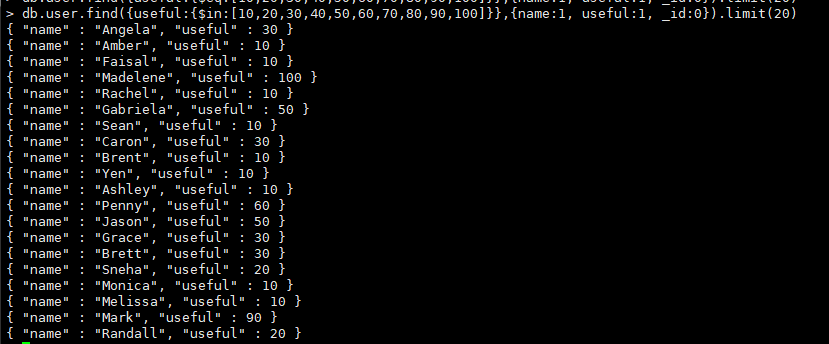

## 任务2：MongoDB实验

### 启动实验
xshell
```
sudo systemctl start mongod
mongo admin -u admin -p
(password)
use yelp
```

### a) . 条件查询与执行计划:
1.	查询business集合的5条数据, 跳过前5条.
（考察点：skip，limit，难度：★☆☆）

```
db.business.find().skip(5).limit(5);
```


2.	查询business集合中state是CA并且BikeParking为True的5条数据.
（考察点：简单的条件查询，难度：★☆☆）

```
db.business.find({state:"CA", "attribute.BikeParking":"True"}).limit(5)
```


3.	查询review集合中useful大于500的评论, 只需要返回business_id, user_id和useful,限制10条数据.
（考察点：简单条件查询，返回指定列，难度：★☆☆）

```
db.review.find(
    {useful:
        {$gt:500}
    },
    {business_id:1, user_id:1, useful:1, _id:0}).limit(10)
```


4.	查询user集合中useful属于[10, 20, 30, 40, 50, 60, 70, 80, 90, 100]的user, 返回name和useful, 限制20条数据.
（考察点：$in的使用，难度：★☆☆）

```
db.user.find({useful:{$in:[10,20,30,40,50,60,70,80,90,100]}},{name:1, useful:1, _id:0}).limit(20)
```


5.	查询user集合中100 <= fans < 200且useful >= 1000的user, 返回name, fans, 以及useful, 限制10条.
（考察点：与条件查询，难度：★☆☆）

```
db.user.find({fans:{$gte:100, $lt:200}, useful:{$gte:1000}}, {name:1, fans:1, useful:1, _id:0}).limit(10);
```


7.	查询business集合city为Westlake或者Las Vegas的数据, 限制返回5条.
（考察点：或条件查询，也可尝试其他方法，难度：★☆☆）

```
db.business.find(
  {
    $or: [
      { city: "Westlake" },
      { city: "Las Vegas" }
    ]
  }
).limit(5);
```


8.	查询business集合中, 找出categories的数量为5的商户, 返回商户的name, categories以及stars, 限制10条.
（考察点：size的使用，难度：★★☆）

```
db.business.find(
  {
    categories: { $size: 5 }
  },
  {
    name: 1,
    categories: 1,
    stars: 1
  }
).limit(10);
```


9.	使用explain看db.business.find({business_id: "5JucpCfHZltJh5r1JabjDg"})的执行计划，了解该查询的执行计划及查询执行时间，并给出物理优化手段，以提高查询性能，通过优化前后的性能对比展现优化程度。
（考察点：查询优化，难度：★★☆）

`db.business.find({business_id: "5JucpCfHZltJh5r1JabjDg"}).explain("executionStats");`


```
解释：
* executionStats: 提供关于查询执行的详细统计信息，包括查询的扫描方式、查询时间、扫描的文档数等。
执行计划
执行时间：65ms
```

```
物理优化：
1. 确保查询字段有索引（不用全表扫描，使用索引扫描）
db.business.createIndex({ business_id: 1 });

2.覆盖索引（覆盖索引会使 MongoDB 直接从索引中返回结果，而不需要回表查询，这会大大提高查询效率。）
db.business.createIndex({ business_id: 1, name: 1, address: 1 });
```


```
优化后的执行时间：1
```

### b) . 聚合与索引:
10.	统计各个州的商店数量, 结果按照商店数量降序排序.
（考察点：简单聚合，难度：★★☆）

```
db.business.aggregate([
  {
    $group: {
      _id: "$state",            // 按照州分组
      storeCount: { $sum: 1 }    // 计算每个州的商店数量
    }
  },
  {
    $sort: { storeCount: -1 }     // 按照商店数量降序排序
  }
]);
```


11.	创建一个review的子集合Subreview(取review的前五十万条数据), 分别对评论的内容建立全文索引, 对useful建立升序索引, 然后查询评价的内容中包含关键词delicious且useful大于等于50的评价,按照review_id进行升序排序， 限制返回5条.
（考察点：子集合的创建，创建索引，索引查询，难度：★★☆）

```
1. 创建Subreview（review的钱50w条数据）
db.review.aggregate([
  {
    $limit: 500000 // 限制取前 50 万条数据
  },  
  { 
    $out: "Subreview" // 将结果输出到 Subreview 集合中
  } 
]);

2. 对评论的内容（text）建立全文索引
db.Subreview.createIndex({ text: "text" });

3. 对useful简历升序索引
db.Subreview.createIndex({ useful: 1 });

4. 查询评价的内容中包含delicious&useful>=50的评论，orderby review_id asc, limit5
db.Subreview.find(
  { 
    $text: { 
      $search: "delicious" 
    }, 
    useful: { 
      $gte: 50 
    } 
  },
  { 
    review_id: 1,
    text: 1,
    useful: 1 
  }  // 只返回 review_id, text, useful 字段
).sort({ review_id: 1 })  // 按照 review_id 升序排序
.limit(5);  // 限制返回 5 条数据
```


12.	在Subreview集合中统计评价中, 找出useful大于50的所有评论, 并返回business_id, 以及平均打星, 按照商家id排序, 限制返回20条记录.
（考察点：聚合运算，难度：★★☆）

```
1. 筛选useful>50    $match
2. 计算平均打星      $group
3. business_id 排序 $sort

db.Subreview.aggregate([
  { 
    $match: { useful: { $gt: 50 } }  // 筛选出 useul 大于 50 的评论
  },
  {
    $group: {
      _id: "$business_id",  // 按商家 ID 进行分组
      average_stars: { $avg: "$stars" }  // 计算每个商家的平均评分
    }
  },
  {
    $sort: { _id: 1 }  // 按商家 ID 升序排序
  },
  {
    $limit: 20  // 限制返回 20 条记录
  },
  {
    $project: {  // 选择返回的字段
      business_id: "$_id",  // 显示商家 ID
      average_stars: 1,  // 显示平均评分
      _id: 0  // 不显示 _id 字段
    }
  }
]);
```


13.	在business表中, 查询距离商家smkZUv_IeYYj_BA6-Po7oQ(business_ id) 2公里以内的所有商家, 返回商家名字, 地址和星级, 按照星级降序排序, 限制返回20条.
提示：使用2dsphere建立索引、获取商家地理坐标、使用坐标进行查询
	（考察点：地图索引，难度：★★★）

```
1. 确保在 business 集合中对地理坐标 (latitude, longitude) 字段创建 2dsphere 索引。这个索引是用来进行地理空间查询的。
db.business.createIndex({ loc: "2dsphere" });

2. 查询目标商家的 latitude 和 longitude
3. 通过 $geoNear 聚合操作符查询商家位置与给定目标位置的距离，限制2公里以内的商家。
4. 在聚合管道中筛选需要的字段，并按星级降序排序。
5. 限制返回20条记录

// 获取商家 smkZUv_IeYYj_BA6-Po7oQ 的地理坐标
const targetBusiness = db.business.findOne({ business_id: "smkZUv_IeYYj_BA6-Po7oQ" });
const targetCoordinates = targetBusiness.loc.coordinates;  // [longitude, latitude]

// 执行 geoNear 查询
db.business.aggregate([
  {
    $geoNear: {
      near: { type: "Point", coordinates: targetCoordinates },  // 目标商家的经纬度
      distanceField: "distance",  // 输出查询到的商家距离
      maxDistance: 2000,  // 设置最大查询距离为2公里（单位：米）
      spherical: true,  // 开启球面计算
    }
  },
  {$sort: { stars: -1 }},// 按照星级降序排序
  {
    $project: {  // 只返回商家名称、地址和星级
      name: 1,
      address: 1,
      stars: 1,
      _id: 0
    }
  },
  {
    $limit: 20  // 限制返回20条记录
  }
]);

```


### c). MapReduce的使用:

15.	使用map reduce计算Subreview集合中每个商店的平均得分, (不要直接使用聚合函数), 输出为一个集合Map_Reduce, 其中应该包括business_id以及values{count(打分次数), sum_stars(总的打分), avg_stars(平均打分)}, 最后查询Map_Reduce, 返回前20条数据.
（考察点：Map Reduce，难度：★★★）
```
1. 在 Map 阶段，按照每个商店的 business_id 对评论进行分组，并累加评论的 stars 数量（用作计数器）和 stars 总和（用作求和）。
var mapFunction = function() {
  emit(this.business_id, { count: 1, sum_stars: this.stars });
};

2. 在 Reduce 阶段，将同一商店的评论数据进行合并，计算出该商店的评价次数、总评分以及平均评分。
var reduceFunction = function(key, values) {
  var reducedValue = { count: 0, sum_stars: 0 };
  
  // 对每个商店的所有评论进行累加
  values.forEach(function(value) {
    reducedValue.count += value.count;
    reducedValue.sum_stars += value.sum_stars;
  });
  
  // 计算平均得分
  reducedValue.avg_stars = reducedValue.sum_stars / reducedValue.count;
  
  return reducedValue;
};

3. 将计算结果保存到一个新的集合 Map_Reduce 中。
db.Subreview.mapReduce(
  mapFunction,       // Map 阶段
  reduceFunction,    // Reduce 阶段
  {
    out: "Map_Reduce" // 输出到 Map_Reduce 集合
  }
);

4. 最后查询 Map_Reduce 集合，返回商店的评价统计数据。
db.Map_Reduce.find().limit(20);
```

