## 任务3：Neo4j实验

### 启动实验
xshell
```
cd neo4j-community-4.0.9
cd bin 
./neo4j console
```

chrome
`/server_ip/7474`

```
http://1.94.189.109:7474/browser/
（password）
```

### 任务

1.查询标签是UserNode的节点, 返回name和userid, 限制返回10条记录. 
（考察点：简单查询，难度：★☆☆）

`MATCH (u:UserNode) RETURN u.name, u.userid LIMIT 10;`

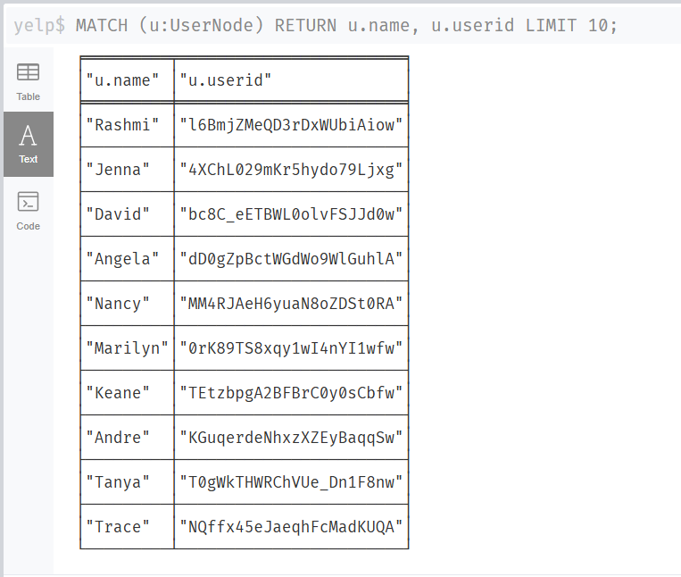

2.查询城市是Ambridge的商家节点, 限制返回5条.
（考察点：简单条件查询，难度：★☆☆） 

`MATCH (b:BusinessNode)-[IN_CITY]->(c:CityNode) WHERE c.city='Ambridge' RETURN b LIMIT 5`

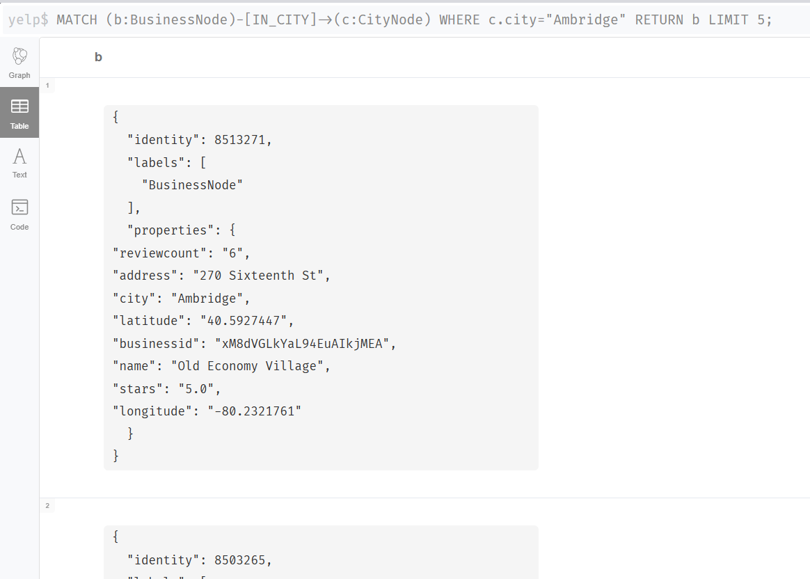
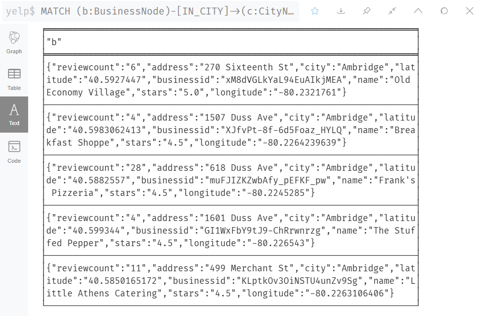

3.查询reviewid是T_8OnmZbyRhnXutFWGqaRg对应的user信息.
（考察点：简单关系查询，难度：★☆☆）

`MATCH(u:UserNode)-[:Review]->(r:ReviewNode) WHERE r.reviewid='T_8OnmZbyRhnXutFWGqaRg' RETURN u`

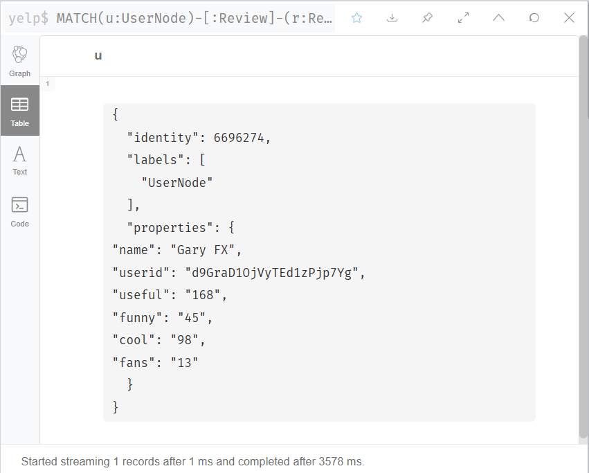

4.查询userid是d9GraD1OjVyTEd1zPjp7Yg的用户所评价的商家的name, stars, 以及该用户评价的stars, 返回前20条记录. 
（考察点：简单关系查询，返回特定列，难度：★☆☆）

`MATCH (b:BusinessNode)<-[:Reviewed]-(r:ReviewNode)<-[:Review]-(u:UserNode) WHERE u.userid ='d9GraD1OjVyTEd1zPjp7Yg' RETURN b.name AS business_name, b.stars AS business_stars, r.stars AS review_stars LIMIT 20`

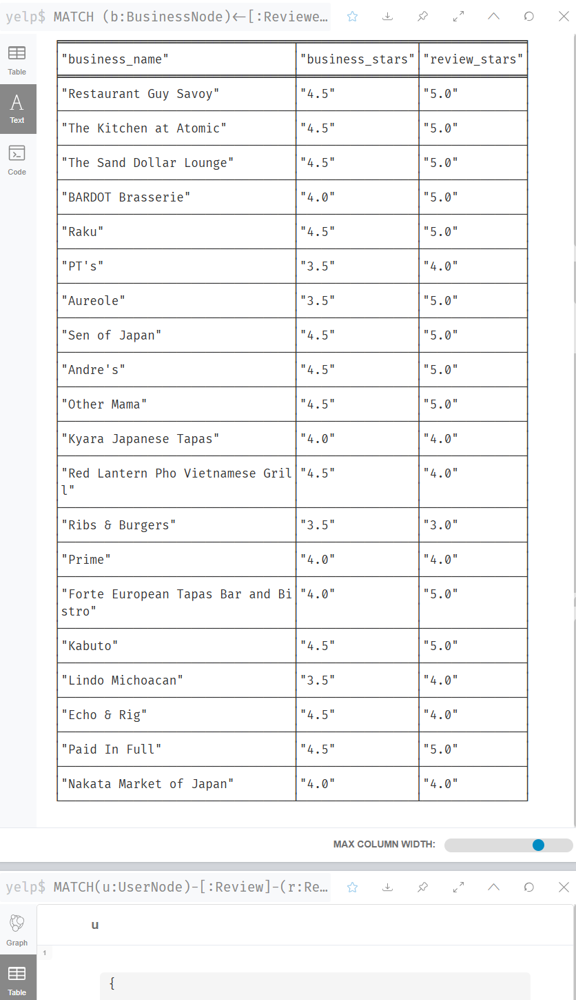

5.查询被userid为d9GraD1OjVyTEd1zPjp7Yg的用户评论为5星的商家name, address以及stars.
（考察点：多关系查询，返回特定列，难度：★★☆）

```
MATCH (b:BusinessNode)<-[:Reviewed]-(r:ReviewNode)<-[:Review]-(u:UserNode)
WHERE u.userid ='d9GraD1OjVyTEd1zPjp7Yg' AND r.stars = '5.0'
RETURN b.name AS business_name, b.address AS business_address, r.stars AS review_stars
```

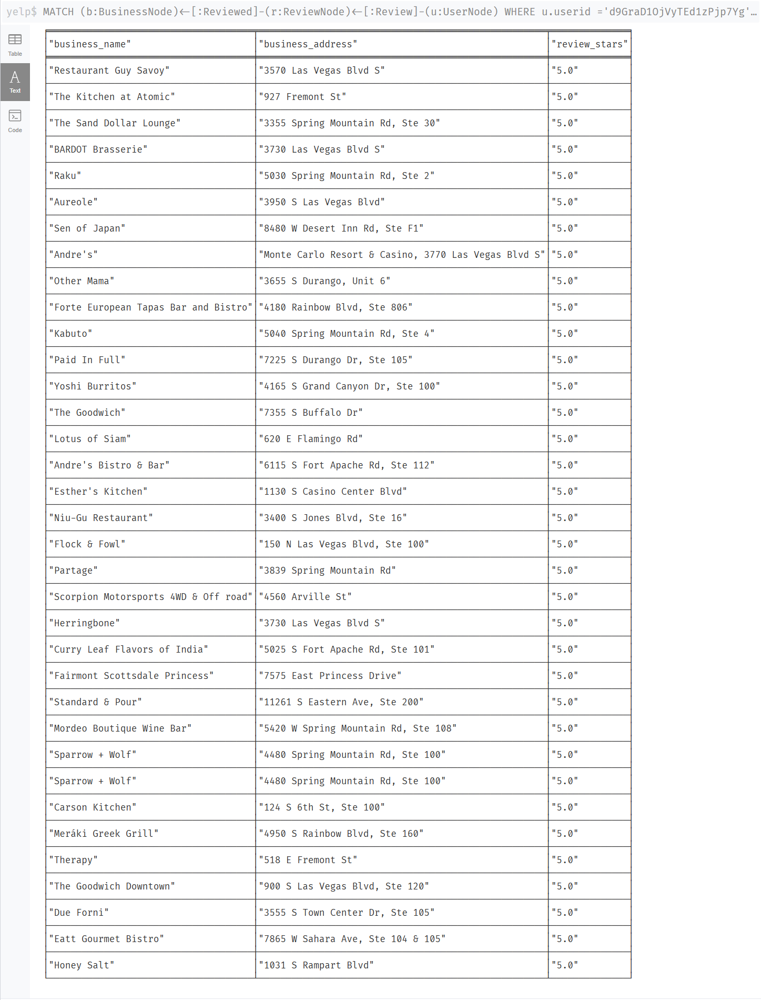

6.查询userid为AWCY8laHjH0-3HMT0LGpUA的用户评价的商家name及用户评价的stars, 按照stars降序排序.
（考察点：查询排序，难度：★☆☆）

```
MATCH (b:BusinessNode)<-[:Reviewed]-(r:ReviewNode)<-[:Review]-(u:UserNode)
WHERE u.userid = 'AWCY8laHjH0-3HMT0LGpUA'
RETURN b.name AS Business_Name, r.stars AS Review_stars
ORDER BY r.stars DESC
```

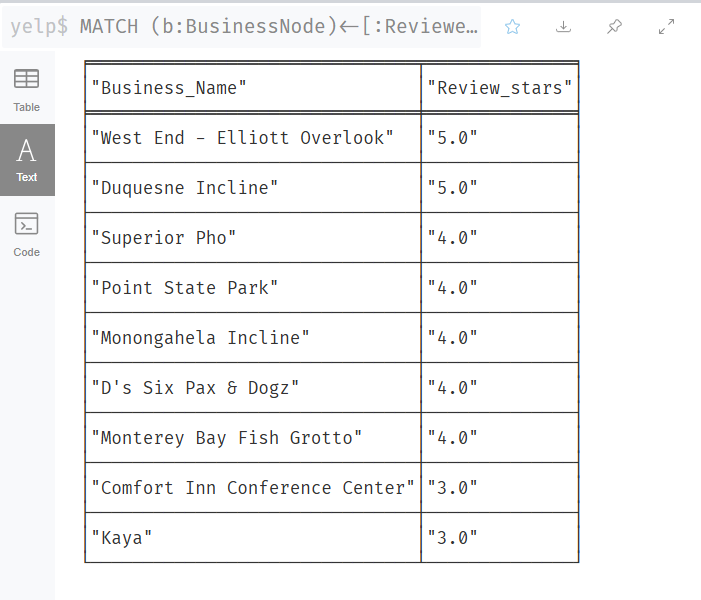

7.使用where查询粉丝数大于200的用户的名字和粉丝数, 这里要注意fans的数据类型是字符串, 比较时使用toInteger()将其类型转换为整型, 限制返回20条记录.
（考察点：where条件查询，难度：★★☆）

```
MATCH (u:UserNode)
WHERE toInteger(u.fans)>200
RETURN u.name AS user_name, toInteger(u.fans) AS user_fans
LIMIT 20;
```

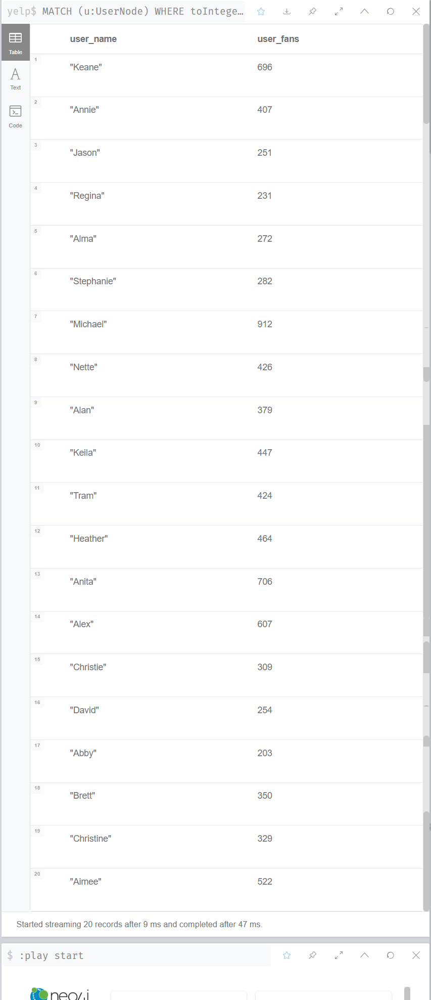


8.查询businessid是tyjquHslrAuF5EUejbPfrw商家包含的种类数,并使用PROFILE查看执行计划, 进行说明.
（考察点：执行计划查看，难度：★★☆）

```
PROFILE
MATCH (b:BusinessNode)-[:IN_CATEGORY]->(c:CategoryNode)
WHERE b.businessid='tyjquHslrAuF5EUejbPfrw'
RETURN COUNT(c) AS category_count;
```

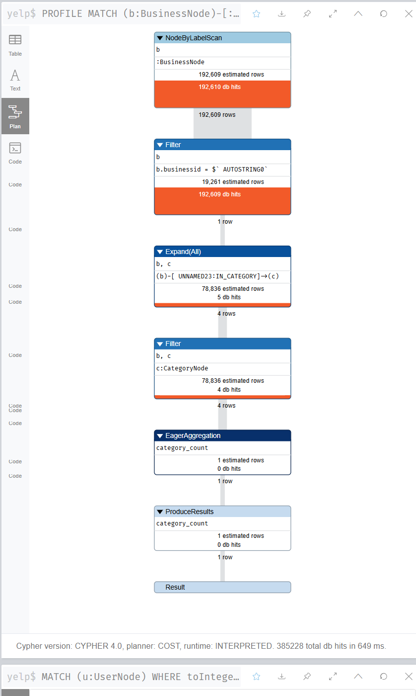
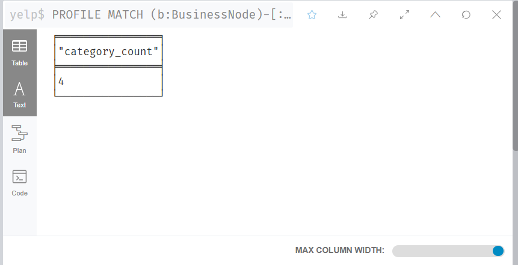


9.查询businessid是KWywu2tTEPWmR9JnBc0WyQ商家包含的种类,以list的形式返回, 同时返回商家的名字.
（考察点：collect的使用，难度：★★☆）

```
MATCH (b:BusinessNode)-[:IN_CATEGORY]->(c:CategoryNode)
WHERE b.businessid='KWywu2tTEPWmR9JnBc0WyQ'
RETURN b.name AS business_name, COLLECT(c.category) AS categories;
```

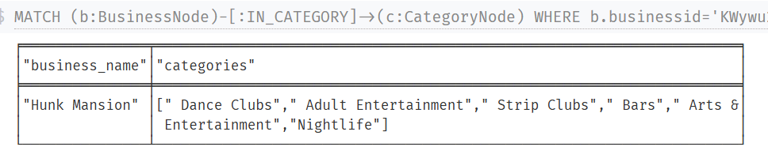


11.查询拥有类别为Salad的商家数量前5的城市, 返回城市名称和商家数量.
（考察点：条件查询，count，难度：★★☆）

```
MATCH (b:BusinessNode)-[:IN_CATEGORY]->(c:CategoryNode)
WHERE c.category ='Salad'
WITH b.city AS city, count(b) AS business_count
RETURN city, business_count
ORDER BY business_count DESC
LIMIT 5;
```

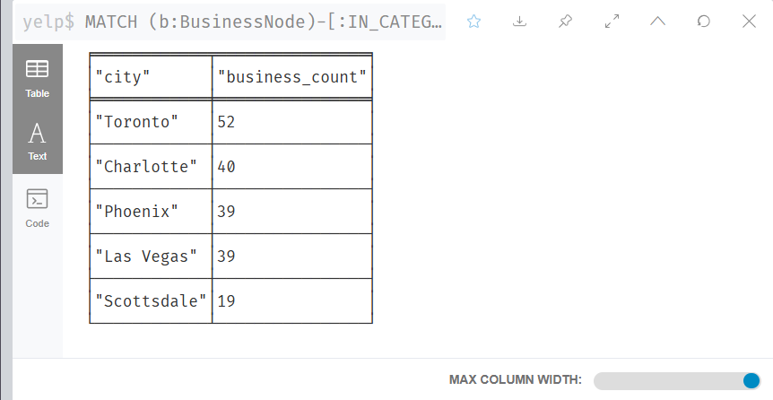


12.查询商家名重复次数前10的商家名及其次数。
（考察点：条件查询，count，难度：★★☆）

```
MATCH (b:BusinessNode)
WITH b.name AS business_name, count(b) AS business_count
RETURN business_name, business_count
ORDER BY business_count DESC
LIMIT 10;
```
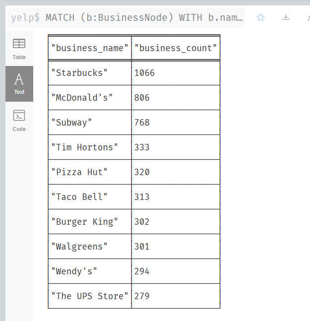
```
WITH的作用
WITH子句允许将查询部分链接在一起，将其中一个部分的结果输送到下一个部分中作为起点或条件。 需要注意的是，with 只影响作用域中的变量。 没有包含在WITH子句中的任何变量都不会转移到查询的其余部分。

比如现在这边
```

13.统计评价过商户id为nh_kQ16QAoXWwqZ05MPfBQ的用户的name以及useful, funny, cool三者的和, 并按照该和降序排列.
（考察点：查询时简单运算，难度：★★★）

```
MATCH (u:UserNode)-[:Review]->(r:ReviewNode)-[:Reviewed]->(b:BusinessNode)
WHERE b.businessid = 'nh_kQ16QAoXWwqZ05MPfBQ'
WITH u.name AS user_name, u.useful + u.funny + u.cool AS total_compliments
RETURN user_name, total_compliments
ORDER BY total_compliments DESC;

这个结果不对，原因是这边的加work as string的那种+， 要做算术的+要把value转换成int
```
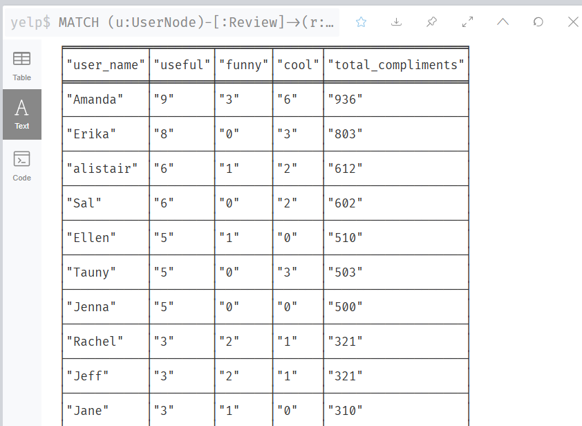
```
MATCH (u:UserNode)-[:Review]->(r:ReviewNode)-[:Reviewed]->(b:BusinessNode)
WHERE b.businessid = 'nh_kQ16QAoXWwqZ05MPfBQ'
WITH u.name AS user_name, 
	 toInteger(u.useful) AS useful, 
     toInteger(u.funny) AS funny, 
     toInteger(u.cool) AS cool, 
     (toInteger(u.useful) + toInteger(u.funny) + toInteger(u.cool)) AS total_compliments
RETURN user_name,useful,funny,cool, total_compliments
ORDER BY total_compliments DESC;
```

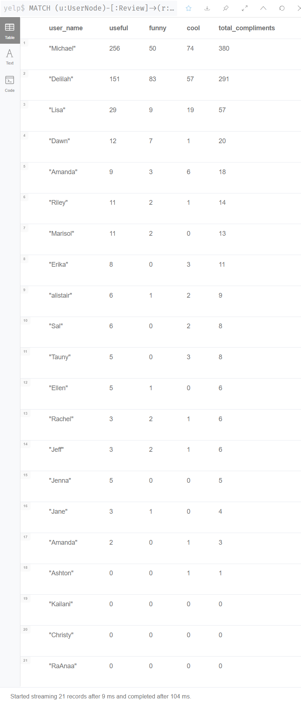

14.查询具有评分为5.0的Propane类别的商铺的名字和所在的城市以及地址.
（考察点：多关系联合查询，难度：★★★）

```
MATCH (b:BusinessNode)-[:IN_CATEGORY]->(c:CategoryNode)
WHERE b.stars = '5.0' AND c.category = 'Propane' 
RETURN b.name AS business_name, b.city AS city, b.address AS address;

查询结果只有3条，这个是因为我用的stars是business的stars， 理应用review的stars
```
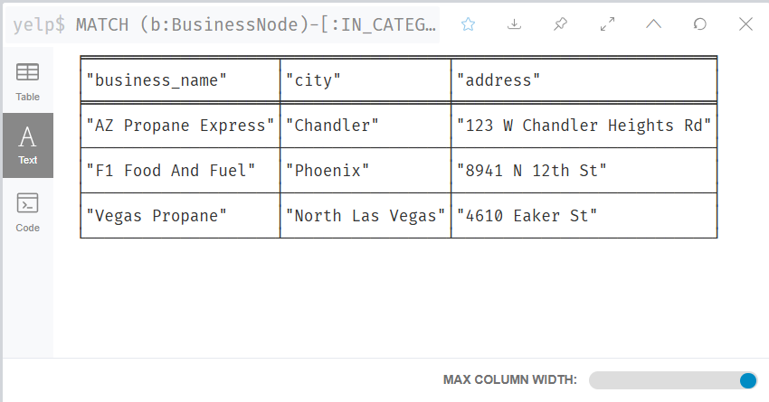

```
MATCH(r:ReviewNode)-[:Reviewed]->(b:BusinessNode)-[:IN_CATEGORY]->(c:CategoryNode)
WHERE r.stars = '5.0' AND c.category = 'Propane' 
RETURN DISTINCT b.name AS business_name, b.city AS city, b.address AS address;
```

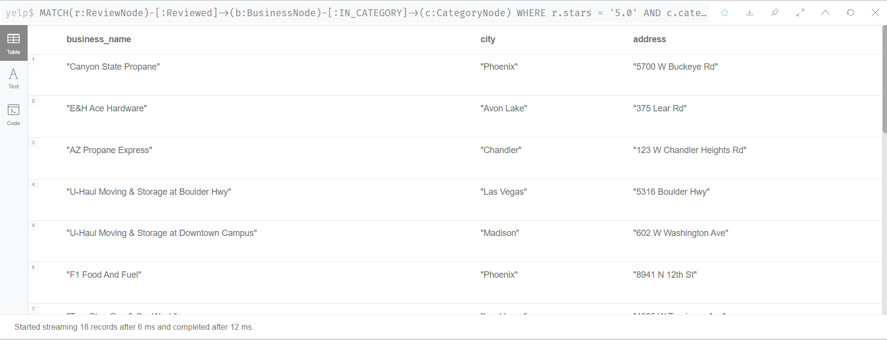

15.统计每个用户评价过多少个不同的商家, 按照此数量降序排列, 返回name, fans, useful以及评价过的不同商家数 结果限制20条记录.
（考察点：条件查询，count，难度：★★★）

```
MATCH (u:UserNode)-[:Review]->(r:ReviewNode)-[:Reviewed]->(b:BusinessNode)
WITH u, COUNT(DISTINCT b) AS business_count
RETURN u.name AS user_name, u.fans AS fans, u.useful AS useful, business_count
ORDER BY business_count DESC
LIMIT 20;
```

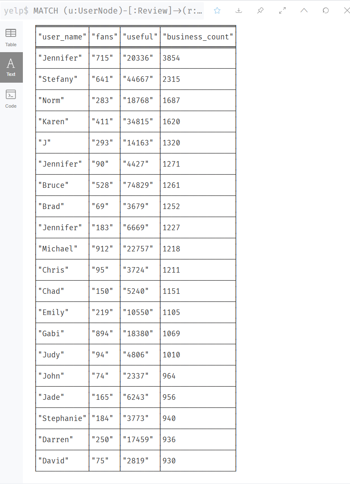

16.体会建立索引对查询带来的性能提升，但会导致插入，删除等操作变慢（需要额外维护索引代价）。
（考察点：创建索引，难度：★★☆）

```
1. 创建没有索引的数据库查询、执行查询，记录查询时间
```
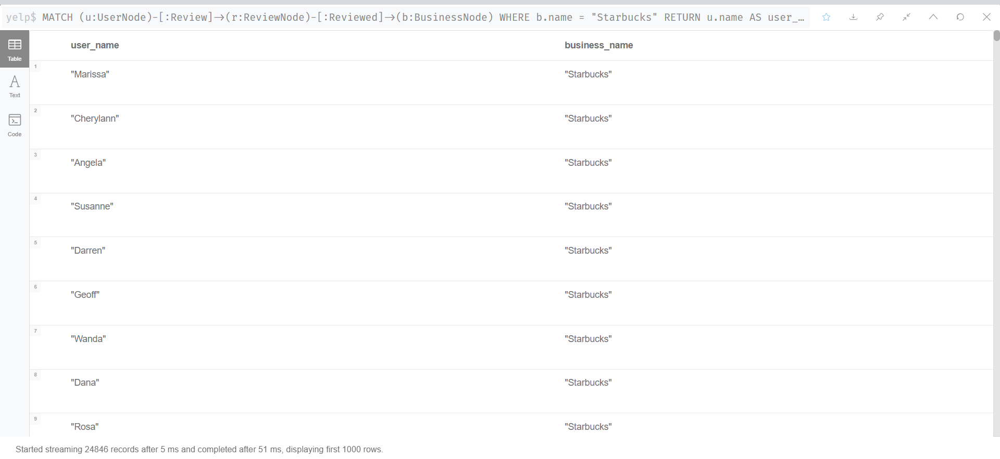

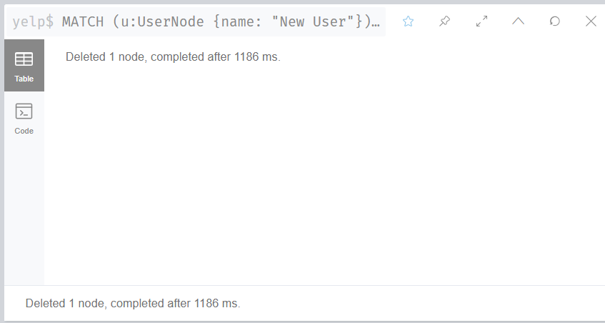

```
2. 创建索引，user_id， 进行查询， 比较两者查询时间
CREATE INDEX ON :UserNode(name);
CREATE INDEX ON :BusinessNode(name);
```
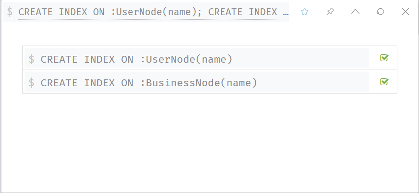
```
PROFILE
MATCH (u:UserNode)-[:Review]->(r:ReviewNode)-[:Reviewed]->(b:BusinessNode)
WHERE b.name = "Some Business"
RETURN u.name AS user_name, b.name AS business_name;
```
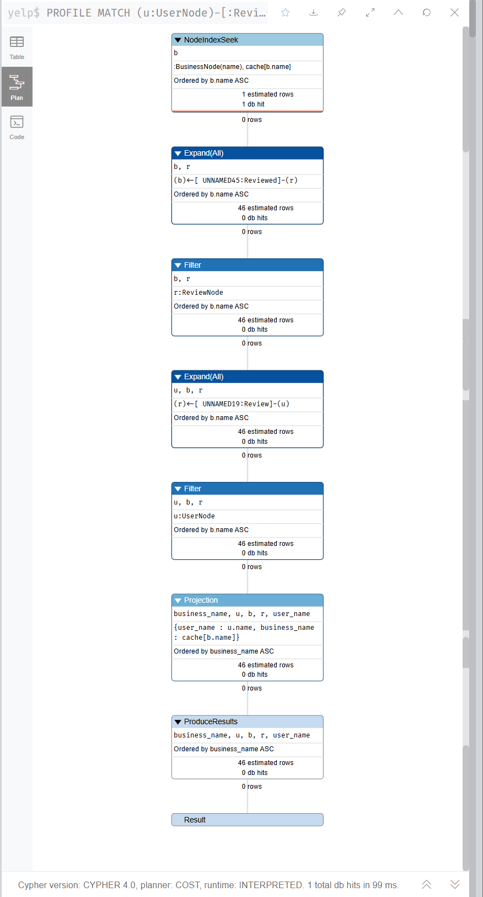

```
CREATE (u:UserNode {name: "New User", fans: "100", useful: 50});
MATCH (u:UserNode {name: "New User"}) DELETE u;
```


|类别 |查询 | 插入|删除|
| ---| --- | --- | --- |
|普通 | 51 | 280 | 1186 |
|索引 | 99 |  8  |  3   |

17.查询与用户`user1`（`userid: 4i4lyXBigT2HShIjw7TbDw`) 不是朋友关系的用户中和`user1`评价过相同的商家的用户, 返回用户名、共同评价的商家的数量, 按照评价数量降序排序, 查看该查询计划, 并尝试根据查询计划优化.
（考察点：多关系联合查询，with，count，难度：★★★）

```
point: 找不是朋友but评价过同一个店的用户， return用户名，common评价数量（DESC）。看查询计划and try to优化

1. 首先需要找到 user1 与哪些用户没有朋友关系。
2. 然后，查询这些用户与 user1 共同评价过哪些商家。
3. 计算每个用户与 user1 共同评价的商家数量。
4. 按照共同评价商家的数量降序排序。
5. 使用 PROFILE 查看查询执行计划，根据查询计划做优化。
```
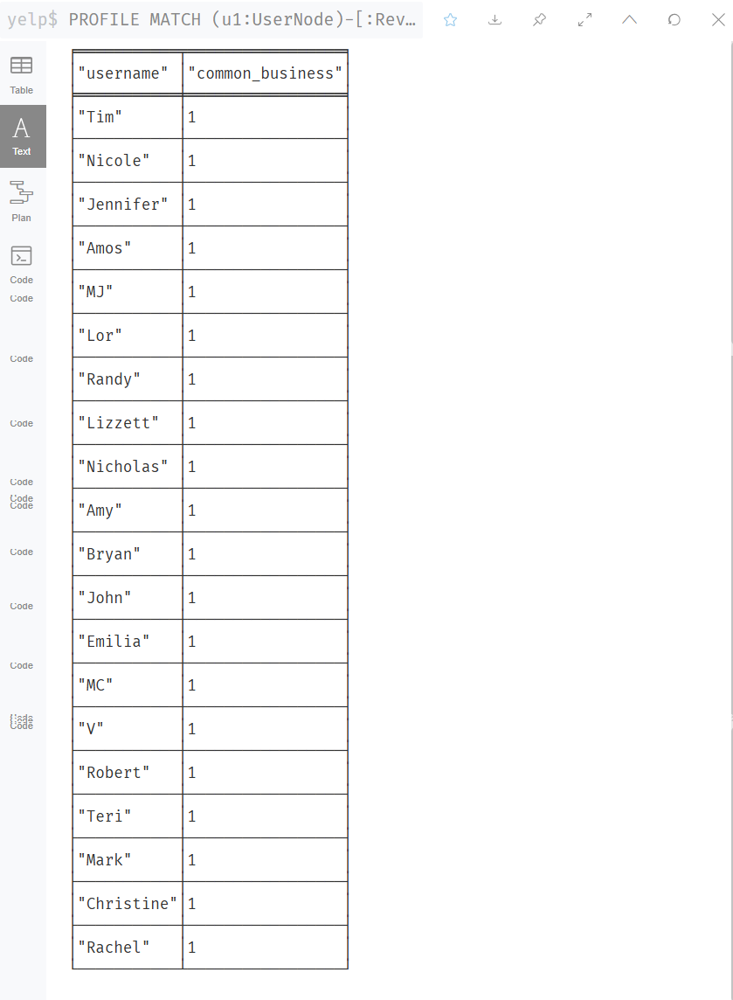

```
PROFILE
MATCH (u1:UserNode)-[:Review]->(r1:ReviewNode)-[:Reviewed]->(b:BusinessNode)
WHERE u1.userid = '4i4lyXBigT2HShIjw7TbDw'
WITH u1, b, COUNT(DISTINCT r1) AS common_reviews
MATCH (u2:UserNode)-[:Review]->(r2:ReviewNode)-[:Reviewed]->(b:BusinessNode)
WHERE u2<>u1 AND NOT (u1)-[:HasFriend]-(u2) AND r2.stars IS NOT NULL
WITH u2, count(DISTINCT b) AS common_business
RETURN u2.name AS username, common_business
ORDER BY common_business DESC
LIMIT 20;
```

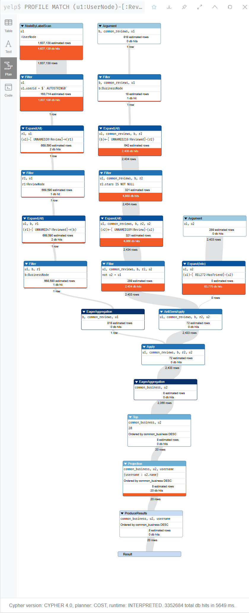

```
查询优化：
1. 索引优化：
    确保 userid, name 字段有索引。可以为 UserNode 创建索引，以加速对 userid 和 name 的查找：
    CREATE INDEX ON :UserNode(userid);
    CREATE INDEX ON :UserNode(name);

2. 避免多次扫描相同的节点：
    在 MATCH 中避免重复扫描相同的商家或用户节点。可以考虑将查询中的重复部分进行合并或优化，避免不必要的遍历。

3. 优化 NOT 操作：
    排除与 user1 的朋友关系时，NOT 操作可能导致性能瓶颈，尤其是在数据量较大时。可以通过 WITH 临时存储过滤后的数据来减少这种影响。

4. 避免无用的数据遍历：
    在进行 COUNT 时，如果不需要完整遍历某些关系（例如评价分数为 NULL 的评价），可以加上更具体的过滤条件以减少数据量。
```


18.分别使用Neo4j和MongoDB查询review_id为TIYgnDzezfeEnVeu9jHeEw对应的business信息, 比较两者查询时间, 指出Neo4j和MongoDB主要的适用场景。
（考察点：多数据库的比较，难度：★★☆）

```
Neo4j:
MATCH (r:ReviewNode {review_id: 'TIYgnDzezfeEnVeu9jHeEw'})-[:Reviewed]->(b:BusinessNode)
RETURN b;
```

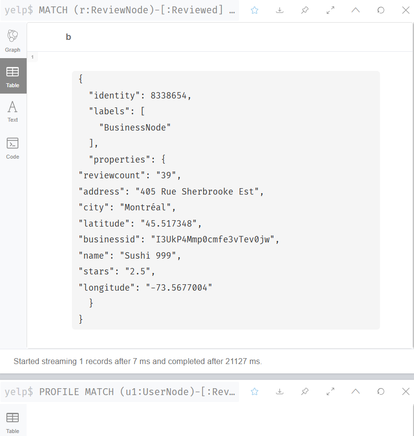

```
Mongo: 
db.Review.aggregate([
  { $match: { review_id: 'TIYgnDzezfeEnVeu9jHeEw' } },
  { $lookup: {
      from: "Business", 
      localField: "business_id", 
      foreignField: "business_id",
      as: "business"         
  }},
  { $unwind: "$business" },        
]);

but实验出来没有结果
```