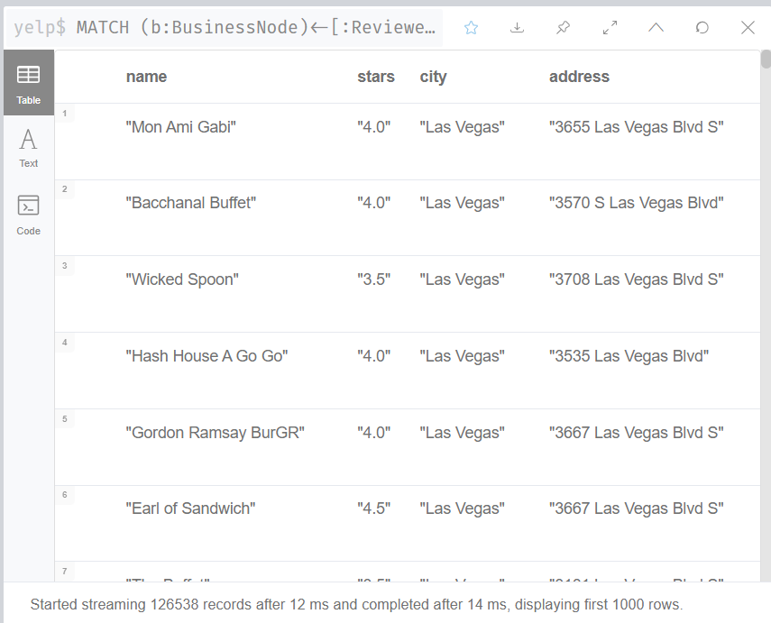
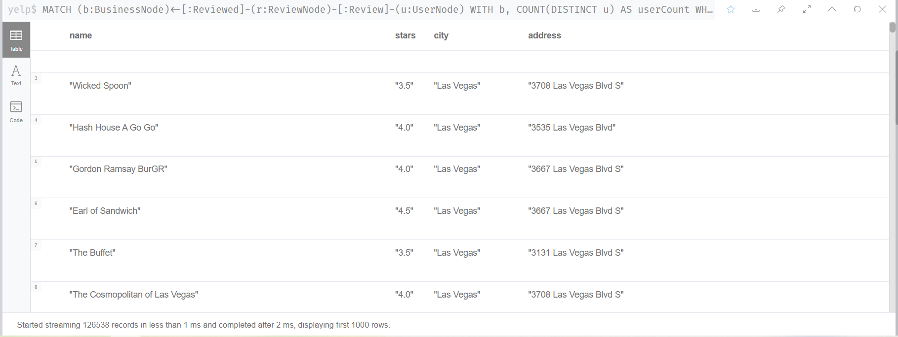
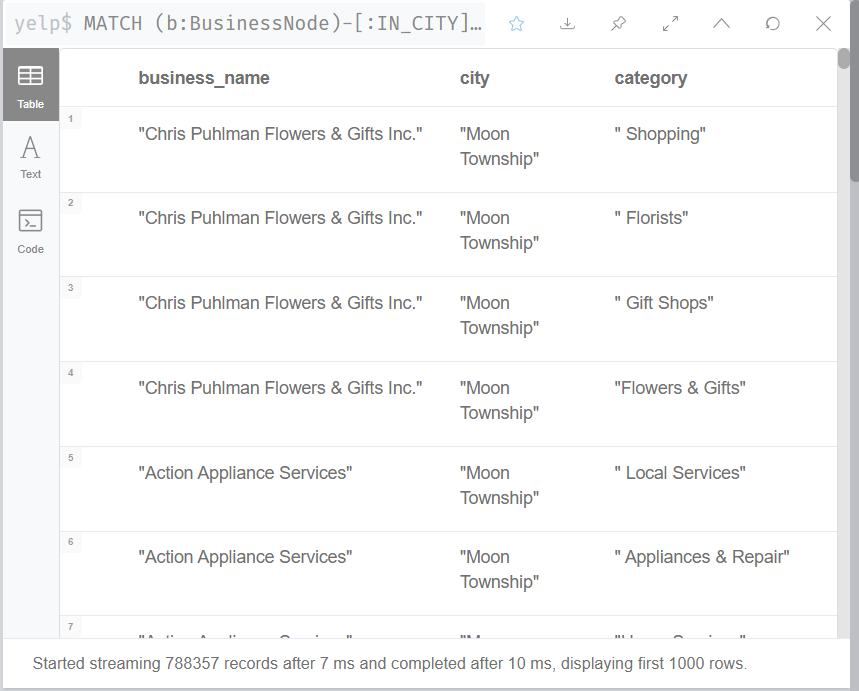

## 任务4：多数据库交互应用实验

### 有问题：2，3（mongo import）

1.使用neo4j查找：找出被超过五个用户评论过的商家, 返回name, stars, city以及address.
（考察点：多关系联合查询，返回指定列，count，难度：★★☆）

```
MATCH (b:BusinessNode)<-[:Reviewed]-(r:ReviewNode)-[:Review]-(u:UserNode)
WITH b, COUNT(DISTINCT u) AS userCount
WHERE userCount > 5
RETURN b.name AS name, b.stars AS stars, b.city AS city, b.address AS address
ORDER BY userCount DESC;
```



2.将1得到的结果导入MongoDB, 并使用该表格数据, 统计每个城市对应的商户数量, 使用aggregate实现.
（考察点：数据库交互，聚合，难度：★★★）

```
MATCH (b:BusinessNode)<-[:Reviewed]-(r:ReviewNode)-[:Review]-(u:UserNode)
WITH b, COUNT(DISTINCT u) AS userCount
WHERE userCount > 5
RETURN b.name AS name, b.stars AS stars, b.city AS city, b.address AS address
ORDER BY userCount DESC;
```



3.在Neo4j中查找所有商家，要求返回商家的名字，所在城市、商铺类。
(1)将查找结果导入MongoDB中实现对数据的去重（提示：使用aggregate，仅保留城市、商铺类型即可）
(2)将去重后的结果导入Neo4j中的新库result中，完成（City-[Has]->Category）图谱的构建。
（考察点：数据库去重，数据库交互，难度：★★★）

